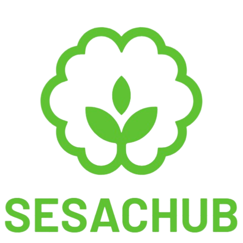
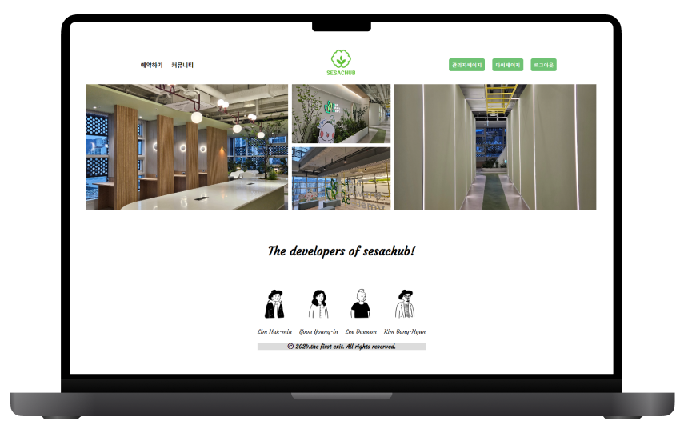

## 🌱 \<SeSAC Hub>를 통해 "청년취업사관학교 도봉캠퍼스"의 공간 예약 및 전용 커뮤니티 서비스를 이용해보세요 🌱

팀 작업 규칙, 컨벤션, 산출물(ERD, FIGMA, API 리스트 등)은 를 확인해 주세요.

 

 

### 작업 기간 : 2024.02.26 ~ 2024.03.13 (약 2주 반)

### 인원 : 4명 (프론트엔드 2명, 프론트 & 백 2명)

### 관리자 로그인 (모든 기능 사용 가능) - 현재 배포 중단하여 사용 불가능

-   ID: `admin123`
-   PW: `admin123@`

 

# 🌱 서비스 소개

<b>🎉1차 팀프로젝트 최우수상 수상작🎉</b>

## 1. 개발 계기 (기획 의도)

### Before (개발 전)

-   “[SeSAC X 코딩온 도봉 1기] 웹 개발자 풀스택 부트캠프”에서 학습한 기술을 실제 프로젝트에 적용하며 성장하고자 함
-   청년취업사관학교 도봉캠퍼스만의 전용 웹 커뮤니티 부재
-   회의실, 상담부스 등 공간 예약을 오프라인으로만 해야하는 불편함

### ⭐ After (개발 후 기대효과)

-   학습한 기술을 실제 프로젝트에 적용하며 복습 및 개발 능력 향상
-   SeSAC 교육생 및 관계자만의 Private한 온라인 커뮤니티 공간에서 자유롭고 활발한 소통과 정보 공유를 지원
-   공간 예약을 온라인으로 가능하게 함으로써 교육생과 관리자 모두에게 편의성을 제공

## 2. 서비스 타겟

-   SeSAC 교육과정 **교육생 및 수료생**
-   공간 예약 하려는 **SeSAC 관계자**
-   간편하게 예약 관리를 하고싶은 **관리자**

 
 
 

# 🌱 기능 소개

#### 학습한 내용을 최대한 활용하고, 실제 서비스로 운영하기 위해 예외처리에 많은 신경을 썼습니다.

 

### 💻 시연 영상

https://github.com/sabb12/sesachub/assets/125553827/beb5ea95-2a20-4094-b2b1-34bdb0e00606

 

### 1. 회원가입/로그인

-   회원 가입 시 bcrypt 모듈로 단방향 암호화하고 비밀번호를 해시화하여 안전하게 저장합니다.
-   회원 가입 시 placeholder와 안내문구로 입력값에 대한 안내를 하고, 정규표현식으로 각 항목별 예외처리를 했습니다.  
    또한 `addEventListener("input", ()=>{})`으로 입력값을 감지해 일치 여부를 실시간 확인이 가능하도록 했습니다.
-   아이디와 닉네임 모두 중복 검사를 해야 회원 가입이 가능하도록 처리했습니다.

-   express-session 모듈을 이용해 로그인 정보 session에 저장해 활용했습니다.
-   사용자 편의성을 위해 아이디, 비밀번호 입력 후 Enter 키 눌렀을 때 로그인 가능하도록 구현했습니다.

 

### 2. ⭐ 예약 하기

-   동적으로 년, 월, 일이 변경되는 dynamic 달력을 JavaScript로 구현했습니다.
-   로그인 된 회원만 예약이 가능하고, 각 날짜, 장소, 시간별로 이미 예약된 데이터는 선택할 수 없도록 구현했습니다.
-   날짜, 장소, 시간, 인원 모두 선택 했을 때 예약이 가능하고, 하나라도 선택하지 않으면 예약이 불가능 합니다.
-   날짜 > 장소 > 시간 > 인원 순으로 배열에 값을 저장하고, 상위의 값을 새로 선택할 경우 이후 모든 값이 초기화 되도록 했습니다.
-   선택 값은 사용자가 확인할 수 있도록 하단에 데이터를 보여줍니다.

 

### 3. ⭐ 커뮤니티

-   수강생, 관계자, 수료생 등의 권한이 없는 회원은 조회만 가능합니다.
-   HTML의 textarea 태그가 아닌 summernote 에디터 오픈소스를 사용하여 게시글 작성 시 다양한 효과를 줄 수 있도록 구현했습니다.
-   4가지 카테고리(자유, 공부, 취업정보, 자격증 & 어학)로 조회 및 검색이 가능합니다.
-   댓글, 비밀댓글, 대댓글, 좋아요, 북마크 기능을 구현하여 사용자 간의 상호작용과 정보 공유를 활발히 할 수 있도록 했습니다.
-   비밀 댓글은 글 작성자와 비밀 댓글 작성자, 관리자만 조회 가능합니다.

 

### 4. 마이페이지

-   multer를 이용해서 프로필 이미지를 저장하고, 기본 이미지로 변경 시 fs모듈로 저장된 기존의 프로필 이미지 파일을 삭제하여 서버의 uploads 폴더에 저장되는 이미지를 관리할 수 있도록 구현했습니다.
-   정보 수정 또한 회원 가입과 동일한 정규표현식을 적용해 예외 처리를 했고, 닉네임 중복 검사도 실시했습니다.
-   예약 관리 및 게시글 관리 페이지의 pagination을 백엔드에서 처리하여 효율적으로 데이터를 관리하고 서버 부하를 감소했습니다.

 

### 5. ⭐ 관리자 페이지

실제로 운영하게 된다면 관리자 또한 클라이언트이기 떄문에 능동적인 작업이 가능하도록 신경을 썼습니다.

-   회원 관리 페이지에서 회원 정보를 확인 해 수강생, 관계자, 수료생으로 권한을 부여할 수 있습니다.   또한 사용자의 아이디와 이름으로 검색이 가능하고, 비밀번호 분실 회원의 경우 비밀번호 초기화하고 안내해 비밀번호 찾기 기능을 구현했습니다.
-   예약 관리 페이지를 통해 해당 날짜와 장소의 예약을 편리하게 확인 및 예약 취소가 가능하도록 했습니다.
-   게시글 관리는 커뮤니티 페이지 내에서 직접 관리할 수 있도록 구현했습니다.
-   일정 기간동안 운영되는 수업은 종료 후 다른 수업으로 변경될 수 있도록 수업 관리 페이지를 구현했습니다.  이를 통해 새로운 과정의 사용자들이 회원 가입 시 본인의 과정을 선택할 수 있도록 할 수 있습니다.

 
 
 

# 🌱 개발 환경 및 사용 모듈

### Front-end

|                                                                         기술                                                                          | 사용 목적                                                                                                                |
| :---------------------------------------------------------------------------------------------------------------------------------------------------: | :----------------------------------------------------------------------------------------------------------------------- |
|         | 웹 페이지의 구조를 정의하고 다양한 콘텐츠를 표시하여 사용자에게 정보를 전달하는 인터페이스를 구성하기 위해 사용했습니다. |
|        | 웹 페이지의 스타일링을 담당하여 사용자에게 시각적으로 즐거운 경험을 제공하고자 사용했습니다.                             |
|  | 동적인 기능을 추가하고 사용자와의 상호 작용을 가능하게 하기 위해 선택했습니다.                                           |

 

### Back-end

|                                                                        기술                                                                        | 사용 목적                                                                                                                                                                                                               |
| :------------------------------------------------------------------------------------------------------------------------------------------------: | :---------------------------------------------------------------------------------------------------------------------------------------------------------------------------------------------------------------------- |
|  | JavaScript 런타임 환경으로 서버 측 애플리케이션을 개발하기 위해 선택했습니다. 이를 통해 JavaScript로 풀스택 개발이 가능해 언어를 사용하고 익힐 수 있었고, 외부 모듈을 설치해 다양한 기능을 활용할 수 있었습니다.        |
|                                                                                                                                                    | - **`Express`** : Node.js 웹 애플리케이션 프레임워크로 라우팅, 미들웨어 관리, 요청 처리 등을 간편하게 구현하고, 빠르고 유연한 웹 서버를 만들기 위해 선택했습니다.                                                       |
|                                                                                                                                                    | - **`ejs`** : 서버 측 템플릿 엔진으로 HTML 내에서 JavaScript 코드를 실행할 수 있게 해주어 동적인 웹 페이지를 생성해 서버와 클라이언트 간의 데이터 교환을 용이하게 했습니다.                                             |
|                                                                                                                                                    | - **`sequelize`** : MySQL 데이터베이스와의 상호 작용을 단순화하고 효율화하기 위해 선택했습니다. 데이터베이스 스키마 및 쿼리를 자바스크립트 객체로 관리했고, ORM 패턴을 통해 데이터베이스 작업을 추상화할 수 있었습니다. |
|                                                                                                                                                    | - **`multer`** : 파일 업로드를 처리하기 위한 Node.js 미들웨어로, 파일을 서버로 전송할 때 이를 쉽게 처리하고 저장할 수 있어 사용했습니다.                                                                                |
|                                                                                                                                                    | - **`cross-env`** : 여러 환경에서 동일한 환경 변수를 설정할 수 있도록 도와주는 도구로, 프로젝트 환경 설정에 상관없이 사용하기 위해 선택했습니다.                                                                        |
|                                                                                                                                                    | - **`bcrypt`** : Bcrypt를 사용하여 비밀번호를 해시화하고 저장함으로써 보안을 강화하고 사용자 정보를 안전하게 관리하기 위해 선택했습니다.                                                                                |
|                                                                                                                                                    | - **`pm2`** : Node.js 애플리케이션의 프로세스 관리 및 운영을 간편하게 하기 위해 선택했습니다. 이를 통해 무중단 배포를 할 수 있었고, 뿐만 아니라 로그 관리, 재시작 관리 등이 가능해 사용했습니다.                        |
|    | 관계형 데이터베이스인 MySQL을 사용하여 구조화된 데이터를 저장하고 검색할 수 있으며, 안정성과 확장성을 바탕으로 애플리케이션 데이터를 저장하고 관리하기 위해 사용했습니다.                                               |

 

### Deploy

|                                                      기술                                                       | 사용 목적                                                                                                              |
| :-------------------------------------------------------------------------------------------------------------: | :--------------------------------------------------------------------------------------------------------------------- |
|  | 서비스를 배포하고 호스팅하기 위한 클라우드 플랫폼으로, 안정성과 확장성을 제공하며 서비스를 운영하기 위해 선택했습니다. |

 
 
 

# 🌱 팀원별 KDT 회고

|  멤버  | KPT 회고                                                                                                                                                                                                                                                                                                                                                                                                                                                                                                                                                                                                                                                                                                                                                                                                       |
| :----: | :------------------------------------------------------------------------------------------------------------------------------------------------------------------------------------------------------------------------------------------------------------------------------------------------------------------------------------------------------------------------------------------------------------------------------------------------------------------------------------------------------------------------------------------------------------------------------------------------------------------------------------------------------------------------------------------------------------------------------------------------------------------------------------------------------------- |
| 임학민 | **K(Keep, 좋았던 점)**  계획이 꼼꼼하고, 잘하시는 분들이 있어서 진행이 순조로웠습니다. 팀플을 통해서 협업을 경험하고, 팀원 코드 보면서 성장하는 계기가 되서 좋았습니다    **P(Problem, 아쉬운 점)**   HTML 및 CSS를 먼저 완성 하고 기능 구현을 하는게 좋았겠다는 아쉬움이 있었습니다. 그리고 프로젝트 기간이 짧아서 아쉬웠습니다.   **T(Try, 개선 사항)**   다음 팀플에서는 html 및 css 원하는 구조를 잡고 기능을 추가 할 예정입니다.                                                                                                                                                                                                                                                                                                                                   |
| 김봉현 | **K(Keep, 좋았던 점)**  팀원들과 함께 처음부터 끝까지 진행하며 개발한다는 일이 너무 좋은경험이고 뜻깊었습니다. 서로에 기능과 코드 리뷰를 통해서 한단계 더 성장할수 있었습니다.    **P(Problem, 아쉬운 점)**  시간이 너무 촉박해 더 넣고 싶은 기능을 추가하지 못한게 아쉽습니다.     **T(Try, 개선 사항)**  다음 팀플에서는 HTML 및 CSS를 원하는 구조로 잡고 기능을 추가 할 예정입니다. 시간 부족 문제는 더 빠른 개발 속도를 내어 진행하겠다.                                                                                                                                                                                                                                                                                                                            |
| 윤영인 | **K(Keep, 좋았던 점)**  꼭 만들고 싶었던 서비스라 요구사항이 많았는데 팀원분들이 협조를 잘 해주셔서 결과물이 만족스럽게 나왔습니다. 몇개월 전만 해도 RESTFul API에 대한 이해가 전혀 없었는데 이번 팀플을 통해 많은 api를 만들며 기능이 추가될 때마다 재미를 느껴 개발에 대한 흥미를 다시 한 번 확인할 수 있어 좋았습니다.    **P(Problem, 아쉬운 점)**   이메일 인증 기능을 구현하고 싶었는데 시간이 부족해 구현하지 못해서 아쉬웠습니다.    **T(Try, 개선 사항)**   리팩토링을 통해 이메일인증과 추가 기능을 구현해 실제 운영해보고 싶습니다.                                                                                                                                                                                                                            |
| 이대원 | **K(Keep, 좋았던 점)**   혼자서 이렇게까지 코딩을 열심히 해본 적이 없었던 것 같은데 이번 팀 프로젝트를 진행하면서 실력이 많이 늘어난 것 같다! 팀원 분들께서 다들 너무 잘하셔서 질문을 통해 많이 배울 수 있었다! 다들 너무 열정적으로 임해주셔서 순조롭게 진행될 수 있었던 것 같아 좋았다!    **P(Problem, 아쉬운 점)**   다시 생각해보면 별 거 아닌 코드인데 삽질한다고 날린 시간들이 너무 아깝다. 그 시간만 아꼈어도 결과가 훨씬 더 좋았을 것 같아 너무너무 아쉽다. 또한 넣고 싶은 기능들이 많았는데 프로젝트 기간이 너무 짧아서 그 기능들을 다 구현하지 못해 아쉬웠다.    **T(Try, 개선 사항)**   프로젝트는 끝났지만 개인적으로 많은 기능들을 구현해보고 싶다. 또한 남은 프로젝트의 기간들도 대체적으로 짧은 편이라 앞으론 더 빨리 작업할 수 있도록 노력할 것이다.   |
